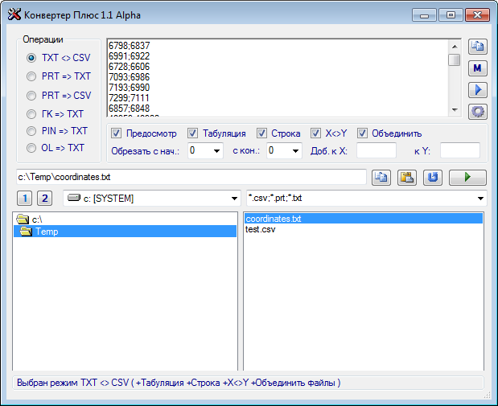

## Converter

### О программе

Утилита converter была написана мною в 2007 году на Microsoft Visual Basic .NET (Microsoft Visual Studio 2005 8.0.50727.42), во время работы в ООО "НПО "Геоинформационные системы и технологии" (г. Липецк) для более удобной и быстрой работы сотрудников с файлами координат. Здесь выложена для истории и возможно кто-то ей ещё воспользуется )

Несмотря на простую реализацию программы и малые трудозатраты, отсутствие рефакторинга, построение грамотной архитектуры, тестирования и т.п., программой успешно пользуются много лет и она до сих пор отлично работает в современных ОС, например, Windows 7 x64, хотя разрабатывалась более 10 лет назад на Windows XP SP2 x86.

Для работы программы требуется установленный Microsoft .NET Framework 2.0 (https://www.microsoft.com/ru-ru/download/details.aspx?id=1639).

### Основные возможности программы:

- Предосмотр
- Быстрый переход между каталогами
- Включает режим предосмотра файлов
- Разделитель - Табуляция
- Добавление пустой строки между парами координат
- Объединение нескольких файлов в один
- Добавить к Y
- Добавить к X
- Обрезать координаты с конца
- Обрезать координаты с начала
- Пересчёт Масштабов
- Сохранение параметров в реестре

### Скриншоты:

